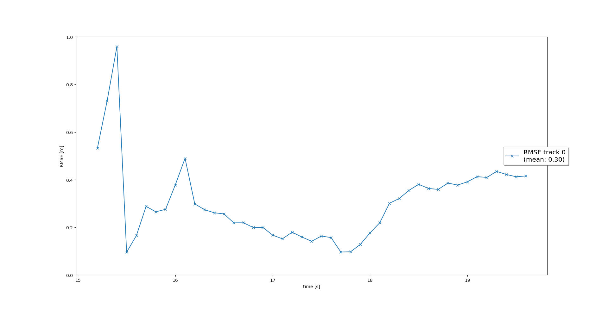
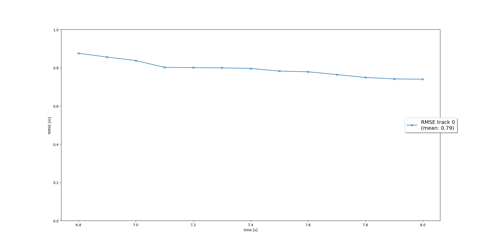
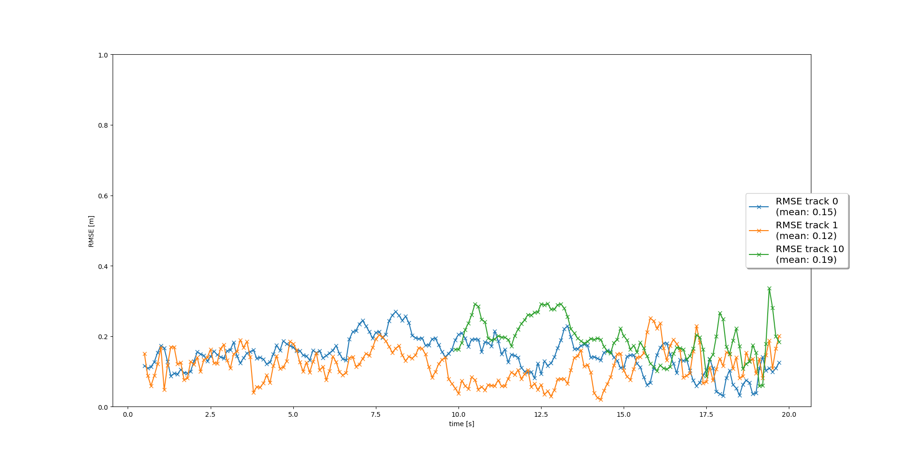
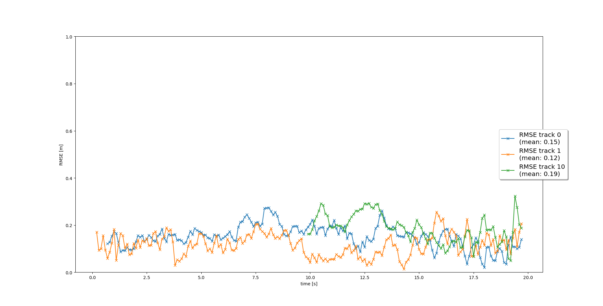

# Writeup: Track 3D-Objects Over Time

Please use this starter template to answer the following questions:

### 1. Write a short recap of the four tracking steps and what you implemented there (filter, track management, association, camera fusion). Which results did you achieve? Which part of the project was most difficult for you to complete, and why?

The results are satisfactory because on the tested sequence, I achieve a good tracking performance of the three vehicles. One particular challenge that I faced
what that for a long time the measurements from the camera were not being associated with any tracks. Playing with the camera covariance matrix I was able to
see the three expected tracks.

### 2. Do you see any benefits in camera-lidar fusion compared to lidar-only tracking (in theory and in your concrete results)?
In theory the camera should be able to remove lidar false positives coming from clutter or other high reflectivity surfaces.
However making them work together is also difficult and requires a lot of tuning.

### 3. Which challenges will a sensor fusion system face in real-life scenarios? Did you see any of these challenges in the project?
- Yes tuning the parameters would a huge task, because we would have to take into account all the different sensors and the different road scenarios.

### 4. Can you think of ways to improve your tracking results in the future?
- Improve the data association with the Hungarian method for examples.
- Use Twiddle to optimize the paramters

### RSME Images

Below the RMSE plots required for the different step are presented.

#### Step 1

#### Step 2

#### Step 3

#### Step 4

