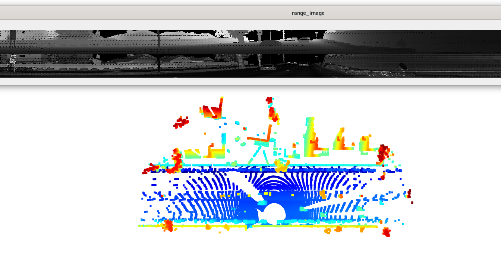

# Writeup: Midterm project 3D Object Detection \

The vehicle features that appear as a stable feature on most vehicles are the rear-bumper, tail-lights and
they tend to be very bright in the intensity map.

